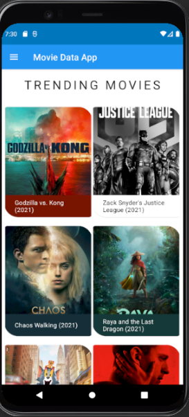
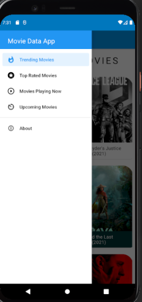
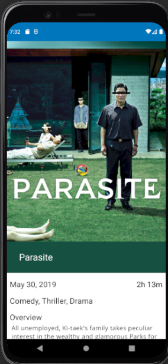
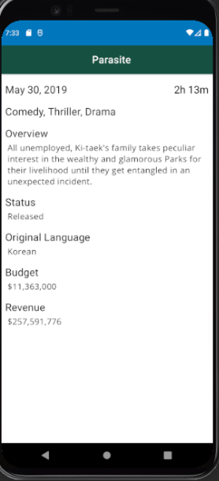

# MovieApp 🎥

**MovieAppII** is an Android application that showcases popular movies using a modern UI. The app is built with **Java**, **Data Binding**, and **RecyclerView** to provide a seamless and efficient user experience.

## Features ✨
- Display a list of popular movies with titles, ratings, and posters.
- Clean and responsive UI with **CardView** for each movie item.
- Efficient data handling using **RecyclerView** and **ViewHolder** pattern.
- Easy to extend with support for additional features like API integration or database storage.

## Tech Stack 🛠️
- **Programming Language:** Java
- **UI Components:** Data Binding, RecyclerView, CardView
- **Image Loading:** Glide
- **Build System:** Gradle

## How to Run the Project 🚀
1. Clone the repository:
   ```bash
   git clone https://github.com/yourusername/MovieAppII.git
## SCREENSHOTS





